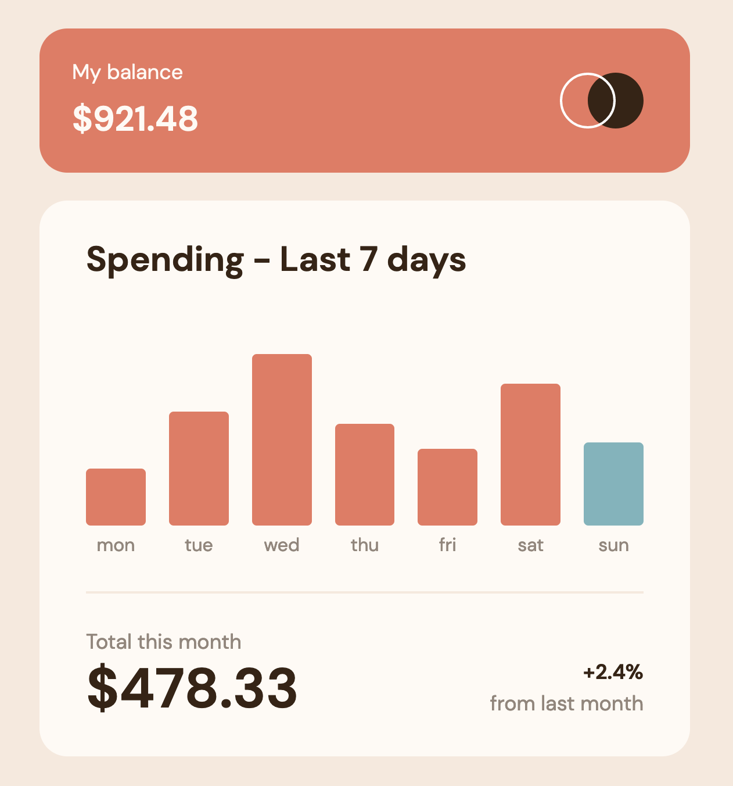

# Frontend Mentor - Expenses Chart Component Solution

This is a solution to the [Expenses Chart Component Challenge on Frontend Mentor](https://www.frontendmentor.io/challenges/expenses-chart-component-e7yJBUdjwt). Frontend Mentor challenges help you improve your coding skills by building realistic projects. 

## Table of contents

- [Overview](#overview)
  - [The challenge](#the-challenge)
  - [Screenshot](#screenshot)
  - [Links](#links)
- [My process](#my-process)
  - [Built with](#built-with)
  - [What I learned](#what-i-learned)
  - [Continued development](#continued-development)
- [Author](#author)

## ## Overview

### ### The Challenge

Users should be able to:

- View the bar chart and hover over the individual bars to see the correct amounts for each day
- See the current day’s bar highlighted in a different colour to the other bars
- View the optimal layout for the content depending on their device’s screen size
- See hover states for all interactive elements on the page
- **Bonus**: Use the JSON data file provided to dynamically size the bars on the chart

### Screenshot

### Links

- Solution URL: [https://www.frontendmentor.io/solutions/expenses-chart-component-solution-using-typescript-and-css-grid-VslA4kNq-Q](https://www.frontendmentor.io/solutions/expenses-chart-component-solution-using-typescript-and-css-grid-VslA4kNq-Q)
- Live Site URL: [https://aaron-romanick.github.io/expenses-chart-component/](https://aaron-romanick.github.io/expenses-chart-component/)

## My Process

### Built With

- Semantic HTML5 markup
- CSS custom properties
- CSS Grid Layout
- Mobile-first workflow
- [SASS](https://sass-lang.com/) - CSS with superpowers
- [TypeScript](https://www.typescriptlang.org/) - Javascript with syntax for types
- [Vite](https://vitejs.dev/) - Next Generation Frontend Tooling

### What I Learned

For this challenge, I decided that I didn't want to pick up any new tools, but simple hone the tools I was already a little familiar with. I decided to mess around a little more with CSS grid as I only have very basic knowledge of it at this point. I decided to "future-proof" my CSS by arranging the CSS variables in such a way that I could add a dark mode theme in the future with ease buy simply altering the color variables. I also made liberal use of the `clamp` function in CSS for when screen sizes shift.

The challenge didn't call for any animation, but since the basic design wasn't too difficult I decided to add intro animations both to the bar graphs as well as the various numbers displayed. I also made sure to respect users who prefer reduced motion by respecting the `prefers-reduced-motion` setting in the browser. The data is pulled into the page from a JSON file using the browser's native `fetch` functionality.

### Continued Development

I'd like to continue working on my TypeScript skills as well as mastering the grid layout in CSS.

## Author

- Website - [Aaron Romanick](https://www.aaronromanick.com)
- Frontend Mentor - [@aaron-romanick](https://www.frontendmentor.io/profile/aaron-romanick)
